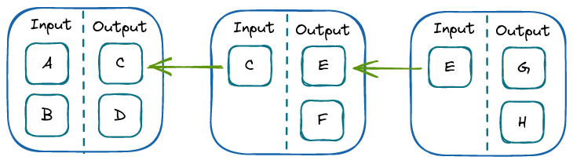
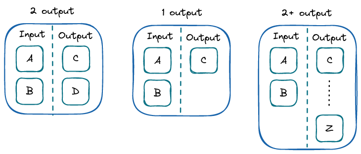
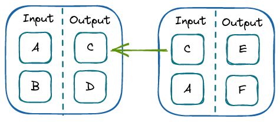
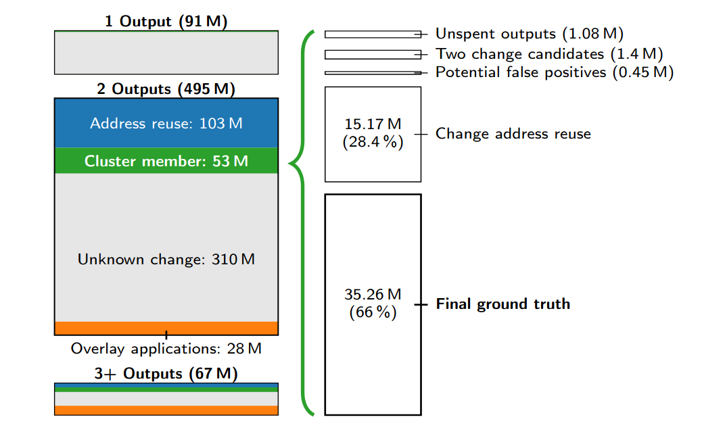
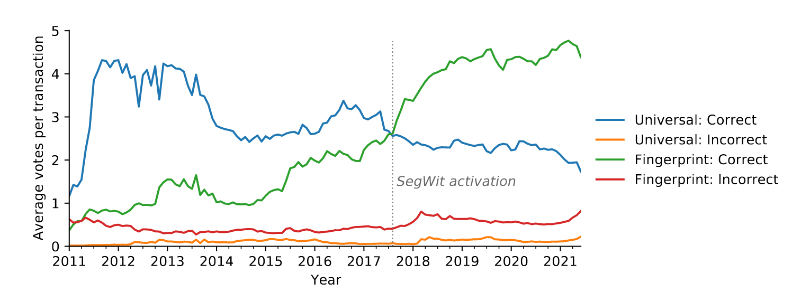
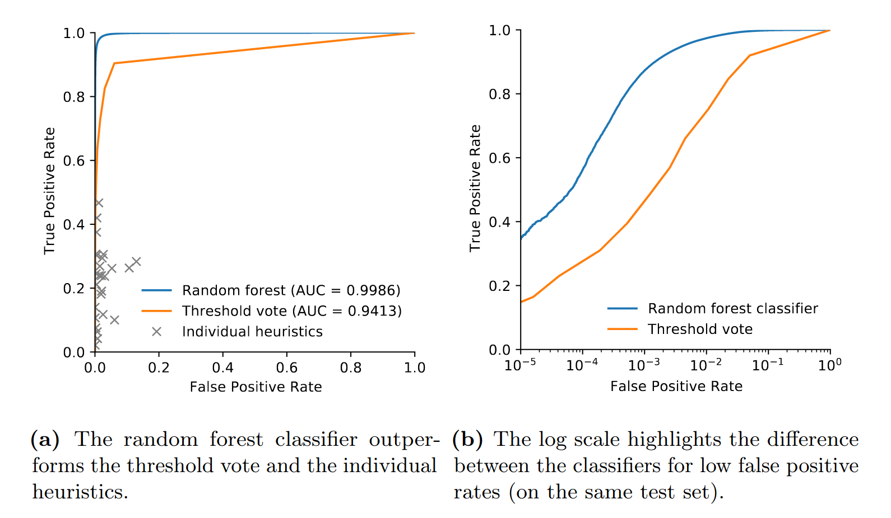

---
title:
- Bitcoin Privacy Concerns
author:
- Imre Molnar
- Bendeguz Seres
theme:
- Copenhagen
date:
- April 11, 2022
---

# Topics

- Bitcoin protocol
- Bitcoin network
- Anonimity
- Deanonimization
- Evading deanonimization
- TODO

# Main Problems

- Ownership is anonymous, flow of money is not:
    - **Pseudo-anonimity**: all transactions are completely transparent
    - As the block chain contains all of the transaction graph, it can be analyzed, searching for *patterns*
- Vulnerable to re-identification attacks:
    - Heuristic clustering to group based on shared characteristics
    - Can be used to identify major institutions and the transactions between them
    - Protecting against this would be a significant effort, lowering usability

# Bitcoin Protocol

- A bitcoin is a **chain of transactions**
- Owners are identified by **public keys**:
    - ECDSA signature scheme
    - Serves as a *pseudonym*
    - Users can use any number of public keys

---

## Transaction

- The previous owner signs the hash of the transaction (in which he got the bitcoin) and the public key of the next owner
- In practice, SHA256 is used
- This signature is added to the set of transactions (that represent the coin itself)
- These transactions **reference the previous one** and form a **chain**
- To check the *validity*, each transaction can be checked in the chain

## Blocks

- Contains transactions
- Serves as a *timestamp*
- They are linked to form a *chain*, each referencing the previous block
- The **block chain** is publicly available to every user

---

## Coin Creation

- Happens while blocks are created
- *Each block begins with a certain amount of zeroes*
- The block contains a *nonce*
- When this nonce is found, the block is broadcasted
- Only **21 million** coin can be generated in total
- Finding the nonce gives a reward of some BTC, which gets progressively lower

# Bitcoin Network

- Each user generates one or more keypairs
- The user makes their public key (also called **address**) publicly accessible
- If the user wants to send bitcoins, they *broadcast a transaction* to peers
- Peers propagate to other peers
- Eventually it reaches a miner, who collects transactions into blocks, then finds the nonce
- The miner also adds a **coin generation transaction**, specifying his address for the reward
- The miner broadcasts the block, which propagates

# Participants

- Individuals generally don't attempt mining on their own:
    - They join mining pools, that distributes the computation, and gives miners a franction of the reward
- Most users avoid mining and buy coins from **exchanges** (using other currencies)
- They keep bitcoins in their digital **wallet**, or they use **wallet services**
- Bitcoin can be used to transact with online vendors

# Statistics

- Transactions per day: 264.000
- Blockchain size: 400GB
- Total number of transactions: 725.000 million
- Most bitcoin belongs to early "hoarders":
    - These "sink" addresses never spent their coins (2013)
- In the early stages, there was only hoarding
- Later most bitcoins were spent almost immediately

# Anonimity

- Identity:
    - Who they pay
    - Who pays them
- Amounts:
    - How much they pay
    - How much they receive
    - Patterns

## Anonimity Types

- Weak: consistent pseudonym (reputation)
- Strong: no reputation

# Clustering Heuristics

- Unique addresses can be linked to a single entity
- Two main heuristics:
    - Different public keys used for transaction from same entity are considered linked
    - *Change addresses*:
        - Exploits a use pattern, not an inherent vulnerability

## Account control

- The entity that controls the account
- It's not enough to know the private key:
    - Services also know you private key, but they don't transact with it (hopefully)
- In case of wallet services, the entity that's responsible for forming transactions is the service provider itself

---

## Change address

- When you want to spend the value of a transaction you received before, you have to *spend all of it*
- The only way to send the fraction of a previous transaction is to use a *change address*, in which the excess is sent back to the sender
- *An address can only send as many times as it has already received*
- *Bitcoins can be divided only by being spent*

# Heuristic 1

- If a transaction uses two or more public keys as input, they belong to the same entity
- This effect is transitive:
    - If we have a transaction with A and B, and an other with B and C, then A, B and C all belong to the same entity

# Heuristic 2

- Focuses on change addresses
- Much less robust
- A common pattern of clients is to create a change address at each transaction, and never reuse it
- By identifying change addresses, not only the receiver, but also the input user can be clustered

# Heuristic 2

- Identifying change addresses:
    - Assumption: they only have 1 input
    - If the output of some transaction has a single address with only 1 input, then it's a change address
    - Exception: coin generation
- So the one-time change addresses are controlled by the same user as the input address
- The major advantage of this heuristic is that we can **eliminate self-churn**:
    - This way we can get a more accurate picture about how much bitcoin each user receives

# Service Centrality

- The centrality of services makes it difficult to stay anonymous, if you want to cash out into fiat money
- Using an exchange is *almost unavoidable* for buying in or cashing out
- There are sites where you can find local buyers or sellers, but not really scaleable
- Exchanges are basically *checkpoints*, where users can be deanonimized (in response to e.g.: a subpoena)

# Theft

- The address of the thief is known
- Exchanges usually refuse these addresses (and sometimes send back the money)
- Laundry services are pretty unreliable
- If the thieves are lacking in smarts, we can easily follow the chain of transactions to an exchange

## Peeling chain

- A chain starts with a relatively large amount of coins
- At each transaction, a smaller amount is "peeled" off:
    - One part is transferred to an other address
    - One part is transferred to a one-time change address
- If we follow the change addresses of these hops, we get the chain of this particular transaction
- We also get the recipients by noting the other address (the "peel")

# Mixing Strategies

## CoinJoin

- Doesn't require the modification of the protocol
- Common control is not required for transactions using multiple input addresses
- Multiple users agree on a set of inputs to spend and a set of outputs to pay to
- All participants has to sign for the transaction to be valid
- The sources and destinations are obscured, transaction graph is obfuscated
- A stronger variant has all the change outputs be the same amount
- These are the most blockchain space efficient strategies

---

## Blind Signature

- The message is disguised (blinded) before it's signed
- The blinding can be removed while leaving the signature intact
- The sender's privacy is preserved
- When the signer verifies the unblinded signature, it will be unable to link the two messages together

## Chaumian CoinJoin

- Additionally uses chaum blind signatures:
    1. User provides input and *blinded* output
    2. Mixer signs the *blinded* output
    3. User unblinds the *signed blinded* output, and gives the server a *signed* output, with a new identity
    4. Mixer verifies the signature and creates the CoinJoin transaction

# ZeroLink

- Offers protection agains privacy breach of user
- The main parts are:
    - Pre-mix wallet
    - Post-mix wallet
    - Mixing technique
- Post-mix wallets have strong privacy requirements
- The requirements together form the **Wallet Privacy Framework**
- Coins are moved from one wallet to the other by mixing:
    - Most on-chain techniques can be used for this
    - ZeroLink has its own: **Chaumian CoinJoin**
- Relies on Tor for anonymous communication with the mixing server
- Implementation: Wasabi Wallet (2018)

# New Method in Address Clustering

## Motivation

- Law enforcement
- User privacy
- Studying economic activity

# Current Methods

- The available techniques are sub-optimal in multiple ways
- *multi-input* - widely used, moderately effective, easy to apply

# Issues

- Lack of ground truth
- Blockchaing inteklligence companies might posess refined data sets, but they are not publicly available
- Clustering applied inconsistently accross studies

# New Approach

- Future transactions can reveal change outputs in past transactions
- Changes in protocol and usage patterns showing the need to use multiple heuristics
- Applying a random forest classifier
- Naive clustering leads to cluster collapse

# Building a Ground Truth Data Set

## Core assumptions

- 2 outputs - *standard* transaction - one of these outpus is a payment and the other receives the change
- 1 outputs - not a good indicator - 
- 2 or more outputs - less likely to originate from an ordinary wallet - (i. e. batch payout)

# Building a Ground Truth Data Set

# Building a Ground Truth Data Set

## Method

- *multi-input* heuristic - later the change outputs are sometimes revealed due to address reuse

# Comparison to interactive collection

## Interactive

- Requires transactions from a variety of different use cases, entities and wallets
- Would be hard to scale beyond a few hundred transactions
- Cannot be done retroactively and is therefore limited to a short, current time frame

## Non-interactive

- Harder to verify the correctness
- The assumption that one of the outputs belongs to the user may not hold
- Can be biased towards entities and wallets that are more prone to reuse and merge addresses.

# Data collection

- Using the **BlockSci** open-source blockchain analysis framework
- It is no longer actively developing
- Blockchain parsed until June 2021 (block height 689 256)
- Base clustering with multi-input heuristic (CoinJoin transactions excluded)

# Data Refining

- 1 output - 91 M
- **2 output** - 495 M
	1. 1.08 million transactions with unspent outputs
	2. 0.97 million transactions where both outputs are in the same base cluster, violating the core assumption
	3. 0.45 million transactions are in preexisting cluster collapse, which could create false positives
	4. Already known change adresses (SatoshiDice, LuchkyB.it)
- 3+ output - 67 M

# Data Refining

# Predicting Change Outputs

The Bitcoin protocol does not explicitly distinguish between change and spend outputs. However, wallets create change outputs automatically to return surplus value when users make payments.

# Heuristic types

1. *Universal heuristic* - use characteristics of the transaction and change output to determine the change
2. *Fingerpring heuristic* -  determine change based on matching characteristics of the transactions spending the outputs.

# Heuristics

1. Optimal change - Only applies to transactions with 2+ inputs
2. Address type - False positives
3. Power of ten
4. Shadow address - Not used here
5. Consistent fingerprint - False positives

# Observations regarding the heuristics

1. The universal heuristics drop over time, likely due to rounded values becoming less common
2. The consistetn fingerprint heuristics see a steady uptick in the number of correct votes due to increasing variety of protocol features available.
3. Uptick in both correct and incorrect fingerprint votes starting in late 2017, when wallet implementations started to switch to SegWit

# Observations regarding the heuristics

# Threshold vote vs. Random forest

- The previous figure suggest that a majority of heursitics should generally identify the correct output.
- Number of heuristics returning potential output varies among transactions, and individual heuristics could be incorrect.
- Threshold vote may not be reliable during different periods of Bitcoins's history.

# Threshold vote vs. Random forest

# Model validation

- Locky and Cerber ransomware (99.6% accuracy)
- GraphSense tagpack (97.6% accuracy)

# Clustering Change Outputs

1. Naive merging leads to cluster collapse
	-  Graphsense tag pack - from 273 clusters 113 merged into a supercluster
2. Constraints prevent cluster collapse
	- In case of, two large exchanges whose users frequently interact with each other, a single misidentified change output could collapse their cluster.

# Impact on Blockchain Analyses

Address clustering is a common preprocessing step before analyzing activity of entities on the blockchain

# Increased cashout flows from darknet markets to exchanges

- The enhanced clustering was used to analyse payment flows from darknet markets to exchanges.
- Relevant for cybercrime researchers, economists, regulators or law enforcement
- It shows **13.8%** increase in bitcoin flows from the darknet markets to exchanges compared to the base clustering.

# Improved estimate of velocity

- The method was used to replicate the analysis of economic activity occuring on the Bitcoin blockchain
- The clustering was used to remove self-payments of users which could inflate extimates.
- It shows **11.9%** reduction in the estimates of bitcoins moved per day between January 2017 to June 2021

# Comparison to the Meiklejohn (first paper) heuristic

- The paper highlights the need for manual intervention to prevent cluster collapse, which is likely infeasible
- The heuristic considers an output to be the change if its addres has only been used a singe time
- The two estimation shows 4.1 million BTC, or USD 38.7 billion difference in economic activity

# References

1. Sarah Meiklejohn, Marjori Pomarole, Grant Jordan, Kirill Levchenko, Damon McCoy, Geoffrey M Voelker, and Stefan Savage. [“A fistful of bitcoins: characterizing payments among men with no names”](https://cseweb.ucsd.edu/~smeiklejohn/files/imc13.pdf) - https://cryptography.fandom.com/wiki/Blind_signature
2. Malte Möser, Arvind Narayanan. ["Resurrecting Address Clustering in Bitcoin"](https://fc22.ifca.ai/preproceedings/87.pdf) - https://cryptography.fandom.com/wiki/Blind_signature
3. [ZeroLink: The Bitcoin Fungibility Framework](https://github.com/nopara73/ZeroLink/blob/master/README.md) - https://github.com/nopara73/ZeroLink/blob/master/README.md
4. [Blind signature](https://cryptography.fandom.com/wiki/Blind_signature) - https://cryptography.fandom.com/wiki/Blind_signature
